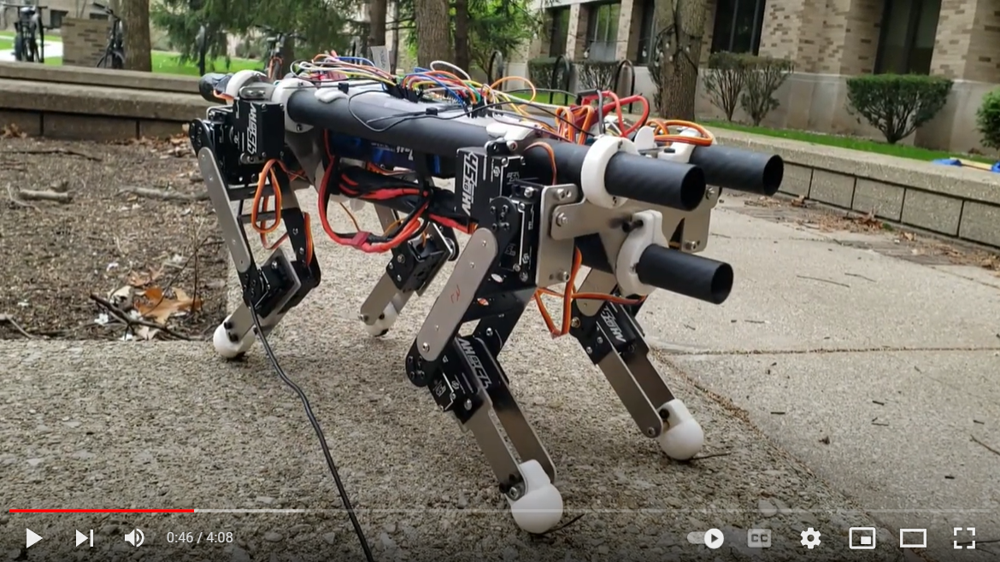

# Kevin-the-Robot-Dog
 
 

Kevin the Robot Dog is a quadruped I created for a final design project at the University of Notre Dame.

Check him out on Youtube:

For more information check out the final report written on Kevin.

- See Final_Report/Automation_and_Controls_Final_Project_Report.pdf
